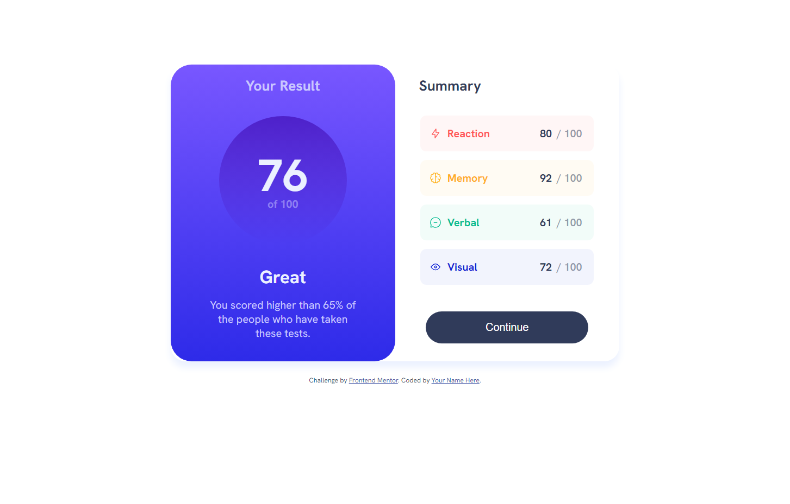
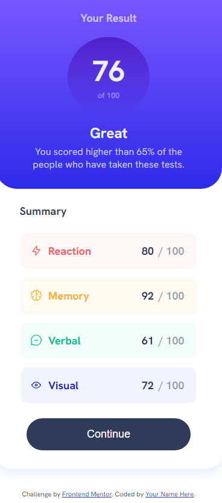

# Frontend Mentor - Results summary component solution

This is a solution to the [Results summary component challenge on Frontend Mentor](https://www.frontendmentor.io/challenges/results-summary-component-CE_K6s0maV). Frontend Mentor challenges help you improve your coding skills by building realistic projects.

## Table of contents

- [Overview](#overview)
  - [The challenge](#the-challenge)
  - [Screenshot](#screenshot)
  - [Links](#links)
- [My process](#my-process)
  - [Built with](#built-with)
  - [What I learned](#what-i-learned)
  - [Continued development](#continued-development)
  - [Useful resources](#useful-resources)
- [Author](#author)

## Overview

### The challenge

Users should be able to:

- View the optimal layout for the interface depending on their device's screen size
- See hover and focus states for all interactive elements on the page
- **Bonus**: Use the local JSON data to dynamically populate the content

### Screenshot

<div align="center">
  
  
</div>

### Links

- Solution URL: [Add solution URL here](https://your-solution-url.com)
- Live Site URL: [Add live site URL here](https://your-live-site-url.com)

## My process

### Built with

- Semantic HTML5 markup
- CSS custom properties
- CSS Grid

### What I learned

Learned how to use CSS grid in practice more, how to use variables in CSS, control opacity in my colors, use @font-face and media query, together with a more organized HTML, i think.

```css
#outer {
  display: grid;
  grid-template-columns: repeat(auto-fit, 375px);
  width: 750px;
  border-radius: 25px;
  box-shadow: 0px 10px 13px var(--pale-blue);
  margin-top: 100px;
  margin-bottom: 25px;
}
```

```css
:root {
  --dark-blue: hsl(224, 30%, 27%);
  --transparent-dark-blue: hsl(224, 30%, 27%, 0.5);
}
```

```css
@font-face {
  font-family: "Hanken-Grotesk";
  src: url(./assets/fonts/HankenGrotesk-VariableFont_wght.ttf);
}
```

```css
@media screen and (max-width: 768px) {
  /* Design for mobile */
}
```

### Continued development

I want to continue learning more about the use of grid in my projects, as well as responsive designs, this project especially is hanging by threads and i do not consider it optimal, nor very responsive, and thats where i wanna work more.

### Useful resources

- [CSS Grid](https://cssgrid.io) - This course has helped me understand how to make use of the CSS grid in my code, highly recommend it.

## Author

- Frontend Mentor - [@StarFilledDonut](https://www.frontendmentor.io/profile/StarFilledDonut)
- Twitter - [@PenguinsDriving](https://twitter.com/PenguinsDriving)
